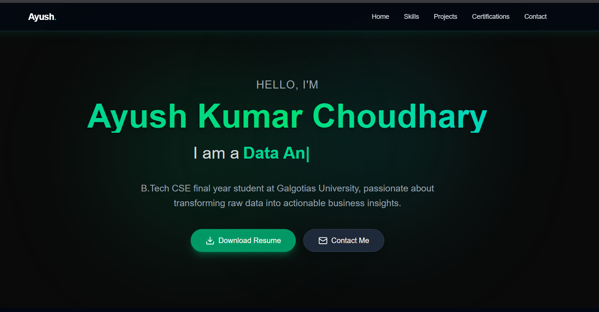
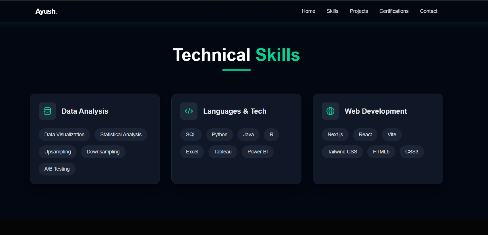

# Data Analytics & Engineering Portfolio

🚀 A modern, interactive Data Analytics & Engineering Portfolio built with Next.js, Tailwind CSS, and Framer Motion.

This is a fully responsive portfolio website showcasing projects, skills, certifications, and providing a contact form for professional inquiries.

## 📋 Table of Contents

- [Features](#features)
- [Screenshots](#screenshots)
- [Tech Stack](#tech-stack)
- [Prerequisites](#prerequisites)
- [Installation](#installation)
- [Building the Project](#building-the-project)
- [Running the Project](#running-the-project)
- [Project Structure](#project-structure)
- [How to Access](#how-to-access)
- [Environment Variables](#environment-variables)
- [Contact](#contact)

## ✨ Features

- **Hero Section** - Eye-catching introduction with smooth animations
- **Skills Section** - Showcase of technical skills and expertise
- **Projects Section** - Detailed project portfolio with descriptions
- **Certifications Section** - Display of professional certifications and achievements
- **Contact Section** - Interactive contact form to get in touch
- **Responsive Design** - Works perfectly on desktop, tablet, and mobile devices
- **Smooth Animations** - Enhanced UX with Framer Motion animations
- **Modern UI** - Built with Tailwind CSS for a sleek, professional look
- **Contact API** - Backend route to handle contact form submissions

## � Screenshots

### Hero Section


_Eye-catching introduction with smooth animations and call-to-action buttons_

### Skills Section


_Showcase of technical skills and expertise_

### Projects Section


_Detailed project portfolio with descriptions and links_

### Certifications Section


_Display of professional certifications and achievements_

### Contact Section


_Interactive contact form for professional inquiries_

### Mobile Responsive View


_Fully responsive design on mobile devices_

**How to Add Screenshots:**

1. **Take Screenshots** - Use your browser's built-in screenshot tool or a tool like Snagit, ShareX, or LightShot
2. **Create `screenshots` Folder** - Create a `public/screenshots/` directory if it doesn't exist
3. **Save Screenshots** - Save your PNG/JPG files in the `public/screenshots/` folder with descriptive names
4. **Update URLs** - Replace the image URLs above with your actual screenshot file names
5. **Example**: If your file is `public/screenshots/home-page.png`, the markdown would be:
   ```markdown
   
   ```

## �🛠️ Tech Stack

- **Framework**: [Next.js 14+](https://nextjs.org/) - React framework for production
- **Styling**: [Tailwind CSS](https://tailwindcss.com/) - Utility-first CSS framework
- **Animations**: [Framer Motion](https://www.framer.com/motion/) - Motion library for React
- **JavaScript**: ES6+
- **Node.js**: Runtime environment
- **npm**: Package manager

## 📦 Prerequisites

Before you begin, ensure you have the following installed on your system:

- **Node.js** (v16.x or higher) - [Download](https://nodejs.org/)
- **npm** (v7.x or higher) - Comes with Node.js
- **Git** - [Download](https://git-scm.com/)
- A code editor (VS Code recommended)

You can verify installations by running:

```bash
node --version
npm --version
git --version
```

## 🚀 Installation

1. **Clone the repository**

```bash
git clone https://github.com/ayushchoudhary336/Data-analyst-resume.git
cd Data-analyst-resume
```

2. **Install dependencies**

```bash
npm install
```

3. **Create environment variables file (optional)**

```bash
cp .env.example .env.local
```

Then update the `.env.local` file with your configuration if needed.

## 🔨 Building the Project

### Development Build

To build and run the project in development mode:

```bash
npm run dev
```

This starts the development server at `http://localhost:3000`. The app will automatically reload when you make changes.

### Production Build

To create an optimized production build:

```bash
npm run build
```

This command:

- Compiles the Next.js application
- Optimizes and minifies assets
- Creates static pages where possible
- Prepares the application for deployment

### Running Production Build Locally

After building, run the production server:

```bash
npm start
```

## ▶️ Running the Project

### During Development

```bash
npm run dev
```

Then open [http://localhost:3000](http://localhost:3000) in your browser.

### In Production

```bash
npm run build
npm start
```

### Linting (Code Quality)

Check for code quality issues:

```bash
npm run lint
```

## 📁 Project Structure

```
portfolio/
├── src/
│   ├── app/
│   │   ├── api/
│   │   │   └── contact/
│   │   │       └── route.js          # Contact form API endpoint
│   │   ├── data.js                    # Static data for portfolio
│   │   ├── globals.css                # Global styles
│   │   ├── layout.js                  # Root layout component
│   │   └── page.js                    # Main home page
│   └── components/
│       ├── Navbar.jsx                 # Navigation bar
│       ├── HeroSection.jsx            # Hero banner section
│       ├── SkillsSection.jsx          # Skills display
│       ├── ProjectsSection.jsx        # Projects showcase
│       ├── CertificationsSection.jsx  # Certifications display
│       ├── ContactSection.jsx         # Contact form
│       └── Footer.jsx                 # Footer component
├── public/                            # Static assets
├── package.json                       # Project dependencies
├── next.config.mjs                    # Next.js configuration
├── tailwind.config.js                 # Tailwind CSS configuration
├── postcss.config.mjs                 # PostCSS configuration
├── jsconfig.json                      # JavaScript configuration
└── eslint.config.mjs                  # ESLint configuration
```

## 🌐 How to Access

### Local Development

1. Run `npm run dev`
2. Open your browser to `http://localhost:3000`

### Live Deployment

The portfolio is deployed and can be accessed at:

- **GitHub Repository**: [https://github.com/ayushchoudhary336/Data-analyst-resume](https://github.com/ayushchoudhary336/Data-analyst-resume)
- **Live Website**: Check the repository for deployment links (typically deployed on Vercel, Netlify, or similar)

### Accessing Specific Sections

- `/` - Home page with all sections
- `/api/contact` - Contact form submission endpoint

## 🔐 Environment Variables

Create a `.env.local` file in the root directory for any environment-specific configurations:

```env
# Example environment variables
NEXT_PUBLIC_SITE_URL=http://localhost:3000
# Add other variables as needed
```

## 📧 Contact

For inquiries about projects, collaborations, or opportunities:

1. **Use the Contact Form** - Available on the portfolio website
2. **GitHub**: [ayushchoudhary336](https://github.com/ayushchoudhary336)
3. **Email**: Available via the contact form on the website

## 📝 License

This project is open source and available under the MIT License.

## 🙏 Acknowledgments

- [Next.js Documentation](https://nextjs.org/docs)
- [Tailwind CSS Documentation](https://tailwindcss.com/docs)
- [Framer Motion Documentation](https://www.framer.com/motion/)
- Inspired by modern portfolio design patterns

---

**Happy coding!** 🎉 Feel free to fork this repository and customize it for your own portfolio.
